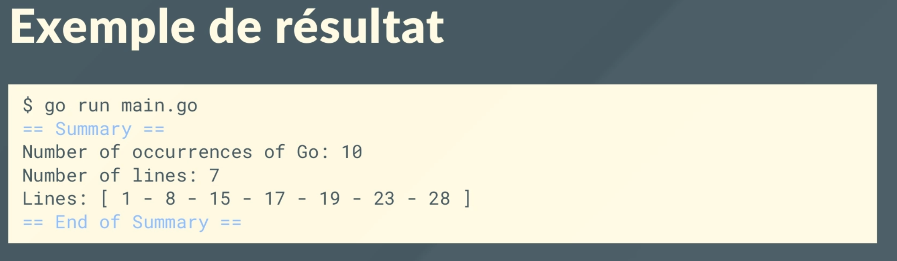

# Mini projet go

## Instructions:

1. Le programme doit lire, remplacer des mots ciblé (par ex le mot "hey") par le mot désiré (par ex par "bye")

### Exemples de fonctionnement dans le terminal:

